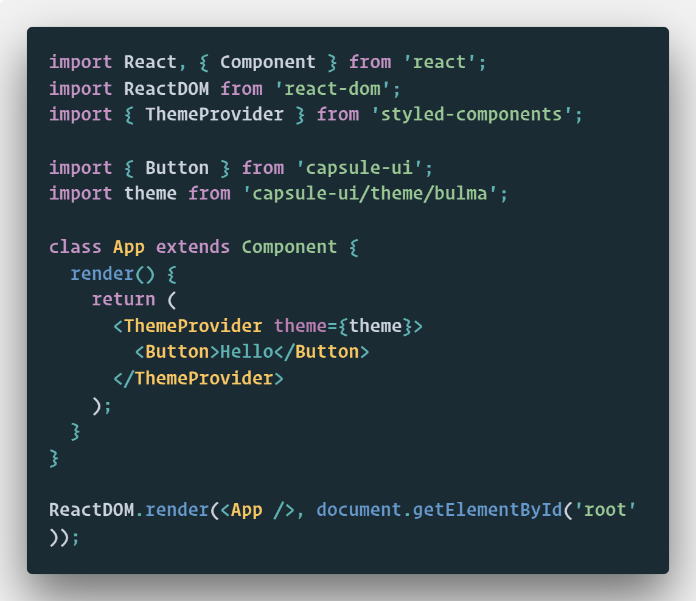

# Capsule UI 💊

Capsule UI is a React UI framework inspired by [Bulma 0.7.1's](https://bulma.io/ "Bulma CSS") flexbox-based grid and styles, and implemented with the help of [styled-components](https://www.styled-components.com/ "Styled Components") and [polised](https://polished.js.org/ "Polished").

## Installation

Add the package to your project with `yarn add capsule-ui`, then import it to your project and pass the theme to the styled-components ThemeProvider:

And that's it! just import the elements you need into your components, and use them as you need. Remember, you also need to have styled-components installed.

## Usage

WIP

## Development

Clone the repo then install the dependencies with `yarn install`.

## Contributing

WIP
